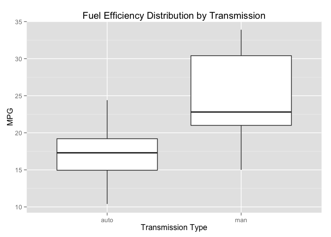
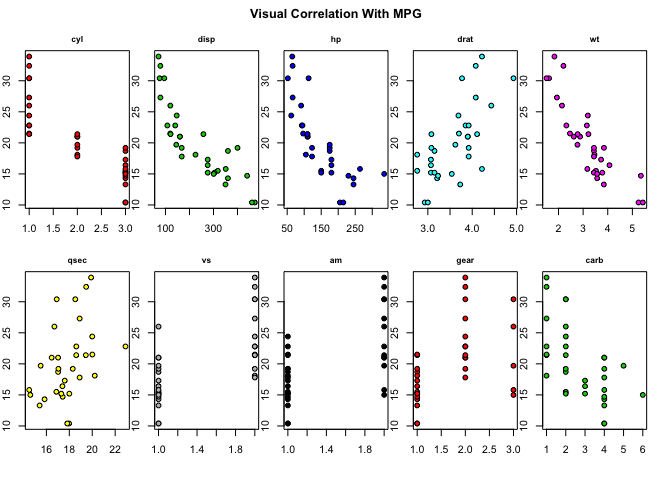
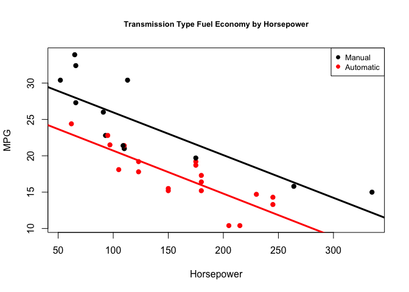

# Examining Effects on Fuel Efficiency

*Executive Summary:* This report examines relationships among a set of car characteristics and fuel efficiency. It finds that a car's transmission (manual or automatic) has a significant effect on average fuel economy (measured in miles per gallon). However, there are a number of other factors contributing to a car's efficiency (e.g. weight, horsepower), and this study finds that a car's transmission *does not* significantly affect the rate of change in fuel economy for at least changes in weight and horsepower. This report was conducted as part of a class assessment for the Johns Hopkins University's ["Regression Models"](https://www.coursera.org/course/regmods) offered through Coursera.

####Loading Data, Initial Exploration
This report is based on the "mtcars" data set included in R's "datasets" package. 

```r
library(datasets);data(mtcars)
```

```r
y <- mtcars$mpg #outcome
n <- length(y)

for (i in c(2,8:11)){
    mtcars[,i]<-as.factor(mtcars[,i]) #qualitative variables
}

levels(mtcars$am) <- c("auto","man") #give levels more descriptive names
```
There are 11 different car characteristics (variables) and 32 cars (observations).

```r
summary(mtcars)
```

```
##       mpg        cyl         disp             hp             drat      
##  Min.   :10.40   4:11   Min.   : 71.1   Min.   : 52.0   Min.   :2.760  
##  1st Qu.:15.43   6: 7   1st Qu.:120.8   1st Qu.: 96.5   1st Qu.:3.080  
##  Median :19.20   8:14   Median :196.3   Median :123.0   Median :3.695  
##  Mean   :20.09          Mean   :230.7   Mean   :146.7   Mean   :3.597  
##  3rd Qu.:22.80          3rd Qu.:326.0   3rd Qu.:180.0   3rd Qu.:3.920  
##  Max.   :33.90          Max.   :472.0   Max.   :335.0   Max.   :4.930  
##        wt             qsec       vs        am     gear   carb  
##  Min.   :1.513   Min.   :14.50   0:18   auto:19   3:15   1: 7  
##  1st Qu.:2.581   1st Qu.:16.89   1:14   man :13   4:12   2:10  
##  Median :3.325   Median :17.71                    5: 5   3: 3  
##  Mean   :3.217   Mean   :17.85                           4:10  
##  3rd Qu.:3.610   3rd Qu.:18.90                           6: 1  
##  Max.   :5.424   Max.   :22.90                           8: 1
```

####Is Automatic/Manual Transmission Better for MPG?
To answer the question about whether an automatic or manual transmission is better for fuel efficiency, we begin by visually exploring the distribution of MPG grouped by transmission. The plot below makes clear that manual transmissions do have a larger mean MPG than automatic but also appear to vary more widely.


```r
library(ggplot2)
g <- ggplot(mtcars,aes(x=am,y=mpg))
g + geom_boxplot()+
    labs(title="Fuel Efficiency Distribution by Transmission")+
    labs(x="Transmission Type",y="MPG")
```

 

To test whether the difference in means for manual and automatic transmissions is significant, we hypothesize that the absolute value of the difference is greater than zero.


```r
# appears significant -- but let's test it!

# Hypothesize that the difference in manual and automatic transmission means is non-zero
manMPG <- mtcars$mpg[which(mtcars$am=="man")]
autoMPG <- mtcars$mpg[which(mtcars$am=="auto")]

df <- ((var(manMPG)/length(manMPG) + var(autoMPG)/length(autoMPG))^2)/
    (
        (var(manMPG)/(length(manMPG)))^2/(length(manMPG)-1)+
            ((var(autoMPG)/length(autoMPG))^2/(length(autoMPG)-1))
        )

# reject null if t-statistic larger than
testCriteria <- round(qt(.975,df),3)
```
- In order to reject a null hypothesis that the difference in the means is *not* zero with 5% or fewer false rejections (type I error rate), the difference must be more than 2.098 standard errors away from zero. The below calculation shows that we reject the null and conclude that the difference is significant with 95% confidence.


```r
standError <- sqrt(var(manMPG)/length(manMPG)+var(autoMPG)/length(autoMPG))

# Test Statistic
(mean(manMPG)-mean(autoMPG))/standError #the number of standard errors the observed difference in means is from zero
```

```
## [1] 3.767123
```

```r
# 95% Confidence interval
mean(manMPG)-mean(autoMPG) + c(-1,1) * qt(.975,df) * standError
```

```
## [1]  3.209684 11.280194
```

```r
#t.test(manMPG, autoMPG, paired=FALSE, var.equal = FALSE)
```

####Quantifying the Relationship Between Transmission Types and MPG
To quantify the relationship between transmissions and fuel efficiency, we need to build and test a regression model for MPG. We begin by visually inspecting the correlations between fuel efficiency and the various car characteristics (variables) from the data. In addition to transmission type, we select car weight and horse power, because their being strongly correlated with MPG has potential explanatory power. Other correlated variables could be a focus for subsequent study. 


```r
par(mfrow=c(2,5), mar=c(3,1,2,1),oma=c(1,1,2,1))
for (i in c(2:11)){
    plot(as.numeric(mtcars[,i]),mtcars$mpg,
         type="p",
         pch=21,
         bg=i,
         main=names(mtcars)[i],
         cex.main=.8)
}
title(main="Visual Correlation With MPG",outer=TRUE)
```

 

```r
par(mar=c(4,4,1,1), oma=c(1,1,1,1), mfrow=c(1,1))
```

 +  Our first attempt models MPG as a function of weight and transmission. Controlling for weight, the transmission type does not appear to be a significant contributor to variation in fuel efficiency (p-value of transmission coefficient is high at 0.988). We notice, however, that transmission types are not evenly represented at all weight values (automatics are clustered at the heavier end), so this preliminary finding may be invalid.
 

```r
fitBoth3 <- lm(mpg ~ hp + am + am*hp,data=mtcars)
# manual mean is higher but change in hp affects both the same.
```
 
 +  Our second attempt models MPG as a function of horse power, transmission, and the interaction of horse power and transmission. It shows that manuals have 5.22 more MPG at zero horsepower than automatics. Furthermore, it demonstrates that there is very little interaction between transmission and horsepower: this means that for each gain in horsepower, fuel economy falls by -0.059 MPG *regardless* of transmission type (a fact that can be seen by the chart below).
 

```r
 plot(mtcars$hp,mtcars$mpg,type="n",main="Transmission Type Fuel Economy by Horsepower",
     cex.main=.8,
     ylab="MPG",
     xlab="Horsepower")
points(mtcars$hp,mtcars$mpg,pch=19,col=((mtcars$am=="auto")*1+1))
abline(c(fitBoth3$coeff[1],fitBoth3$coeff[2]),col="red",lwd=3)
abline(c(fitBoth3$coeff[1]+fitBoth3$coeff[3],fitBoth3$coeff[2]+fitBoth3$coeff[4]),col="black",lwd=3)
legend("topright",c("Manual","Automatic"),
       pch=c(19,19),
       col=c("black","red"),
       cex=.8)
```

 

+  Therefore, we conclude that there is no interaction with horsepower, so removing that term from our model decreases our residual error and improves the amount of variation explained. We center the model on mean horserpower to improve the interprebility of the intercepts.


```r
fitBoth3 <- lm(mpg ~ hp + am + am*hp,data=mtcars) #remove the interaction term
fitBoth2 <- lm(mpg ~ I(hp-mean(hp)) + am,data=mtcars) #and center on mean horsepower
```

+ At an average horsepower of 146.69, manuals have higher MPG (23.22) than automatics (17.95). The interaction between horsepower and transmission was insignificant, so MPG decreases by the same rate for both transmission types for each gain in horsepower. Additional research could consider modeling with additional variables.

###Model Diagnostics
From the chart above, it appears that some points have the potential to exert leverage on our model (change the slope).  To see which cars correspond with these points, we examine the "hat values" diagnostic. The Maserati (hat=0.39) has the potential to exert leverage on our model's explanation of the rate of change of a manual's fuel economy per unit horsepower.


```r
PRESS <- resid(fitBoth2)/(1-hatvalues(fitBoth2)) #PRESS residuals (residual for point i if it is withheld from model)
```
We next examine PRESS residuals, which provide an indication of how well our model does at predicting MPG for specific cars (it witholds the car from the regression and then calculates the residual error for that point). These show that our model over estimates the fuel economy of Mazda's RX4 cars (by -4.76, -4.76 mpg) and under estimates Toyota Corolla and Maserati Bora (by 6.55, 4.72 mpg, respectively)). Thus, we have less confidence in our model's ability to explain extreme cases.

Overall, there does not appear to be a pattern in our model's residual errors, so that means our assumption of error variance having mean 0 is not a bad one.


```r
plot(predict(fitBoth2),resid(fitBoth2),main="Residuals Plot Shows No Pattern",cex.main=.8,xlab="predicted fuel economy",ylab="residual error") # no obvious pattern
```

 
